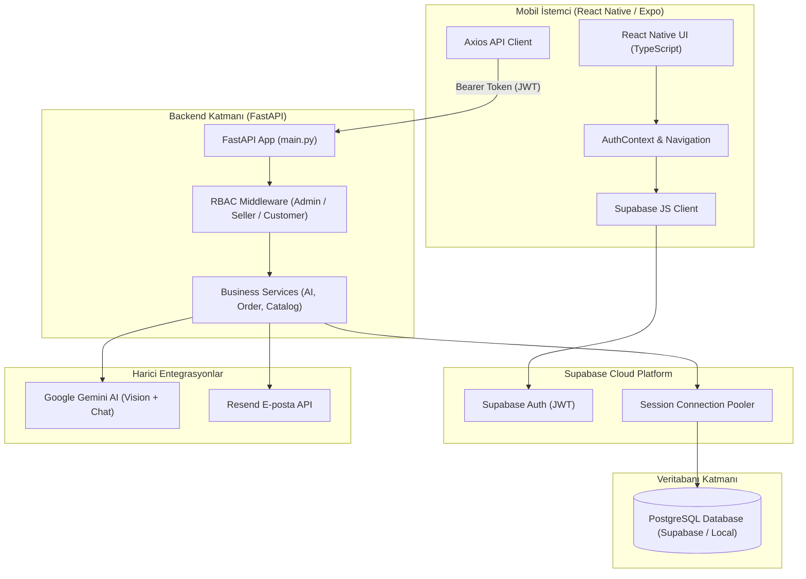

# 🌿 Plant AI Platform — Yapay Zeka Destekli Bitki Bakım ve E-Ticaret Asistanı

> 📖 **Resmi Kurulum & Mimari Dokümanı:** [📄 PLANT_AI_KURULUM_REHBERI.pdf](PLANT_AI_KURULUM_REHBERI.pdf) *(PDF formatında indirmek veya görüntülemek için tıklayın)*


**Plant AI Platform**; kullanıcıların bitki satın alabildiği, sipariş takibi yapabildiği ve hastalıklı veya bakıma muhtaç bitkilerinin **fotoğrafını yükleyerek yapay zeka (Google Gemini Vision) ile anında teşhis ve bakım önerisi** alabildiği uçtan uca mobil e-ticaret ve akıllı botanik platformudur.

---

## 📑 İçindekiler
- [✨ Öne Çıkan Özellikler](#-öne-çıkan-özellikler)
- [🏗️ Sistem Mimarisi](#️-sistem-mimarisi)
- [📁 Proje Klasör Yapısı](#-proje-klasör-yapısı)
- [🔑 Rol Bazlı Yetkilendirme (RBAC)](#-rol-bazlı-yetkilendirme-rbac)
- [🌐 API Uç Noktaları](#-api-uç-noktaları)
- [🚀 Hızlı Başlangıç ve Otomatik Betikler](#-hızlı-başlangıç-ve-otomatik-betikler)
- [👥 Geliştirici Ekibi](#-geliştirici-ekibi)

---

## ✨ Öne Çıkan Özellikler

- 📸 **Yapay Zeka Görsel Analiz (Gemini Vision):** Bitki fotoğrafını analiz ederek hastalık tanısı koyar, bakım tavsiyeleri ve sulama/ışık önerileri üretir (`POST /ai/analyze-image`).
- 💬 **İnteraktif Bakım Asistanı (Gemini Chat):** Sohbet geçmişini koruyan akıllı bot ile bitki bakımı hakkında doğal dilde iletişim (`POST /ai/chat`).
- 🛒 **E-Ticaret ve Sipariş Yönetimi:** Ürün kataloğu, sepete ekleme, sipariş oluşturma, sipariş adımları (Hazırlanıyor, Kargoda, Teslim Edildi) ve sipariş geçmişi (`/catalog`, `/orders`).
- 🔔 **Otomatik Proaktif Bildirimler:** Sipariş durumu değiştiğinde ve önemli sistem hareketlerinde kullanıcıya özel bildirimler (`/notifications`).
- 🎁 **Sadakat Programı ve Kampanyalar:** Kullanıcı puan sistemi, indirim kodları ve kampanya paketleri.
- 🛡️ **Güvenli Kimlik Doğrulama:** Supabase Auth entegrasyonu, JWT Bearer Token güvenliği ve RBAC rol kontrolü.

---

## 🏗️ Sistem Mimarisi



### Teknolojik Stack

| Katman | Teknolojiler |
| :--- | :--- |
| **Mobil Uygulama** | React Native, Expo, TypeScript, React Navigation, Axios |
| **Backend API** | Python 3.10+, FastAPI, Async SQLAlchemy, Alembic, Pydantic |
| **Veritabanı & Auth** | Supabase Cloud, PostgreSQL, Supabase Auth (JWT) |
| **E-posta Servisi** | Resend API (OTP Doğrulama & Bildirimler) |
| **Yapay Zeka Katmanı** | Google Gemini API (`gemini-3.5-flash-lite` Vision + Chat) |
| **Canlı Sunucu** | Railway Cloud Deployment (PaaS) |

---

## 📁 Proje Klasör Yapısı

```
Plant-ai-Platform/
├── PLANT_AI_KURULUM_REHBERI.pdf  # Resmi Kurulum & Mimari Kılavuzu (PDF)
├── backend/                     # FastAPI Backend Uygulaması
│   ├── alembic/                 # Veritabanı Migration Dosyaları
│   ├── app/
│   │   ├── core/                # config.py, supabase_auth.py, security.py (RBAC)
│   │   ├── db/                  # Veritabanı Bağlantısı ve Session Yönetimi
│   │   ├── models/              # SQLAlchemy Modelleri (SQL Tabloları)
│   │   ├── schemas/             # Pydantic Şemaları (Request/Response)
│   │   ├── services/            # İş Mantığı Katmanı (AI, Sipariş, Katalog)
│   │   ├── routers/             # API Uç Noktaları (Endpoints)
│   │   └── main.py              # FastAPI Başlangıç Noktası
│   ├── manage_users.py          # Kullanıcı ve Rol Yönetim Betiği
│   ├── requirements.txt         # Python Bağımlılıkları
│   └── .env.example             # Ortam Değişkenleri Şablonu
│
├── mobile/                      # Expo React Native İstemcisi
│   ├── src/
│   │   ├── context/             # AuthContext (Oturum & Rol Yönetimi)
│   │   ├── lib/                 # supabaseClient.ts (Supabase JS)
│   │   ├── navigation/          # Rol Bazlı Navigasyon (Admin/Seller/Customer)
│   │   ├── screens/             # Ekranlar (Login, Home, AiChat, Orders vb.)
│   │   └── services/            # API Servisi (apiClient)
│   ├── App.tsx                  # Mobil Uygulama Kök Bileşeni
│   └── package.json             # Node.js Bağımlılıkları
│
├── setup.bat                    # Windows: Otomatik Kurulum Betiği
├── setup.sh                     # Linux/macOS: Otomatik Kurulum Betiği
├── run-all.bat                  # Windows: Backend + Mobil Birlikte Başlatıcı
├── run-backend.bat              # Windows: Sadece Backend Başlatıcı
└── run-mobile.bat               # Windows: Sadece Mobil Başlatıcı
```

---

## 🔑 Rol Bazlı Yetkilendirme (RBAC)

Sistem 3 temel kullanıcı rolünü destekler:

1. **Yönetici (Admin):** Tüm kullanıcıları listeleme, rol atama, sistem genelindeki tüm sipariş ve katalogları yönetme yetkisine sahiptir.
2. **Satıcı (Seller):** Kendi ürünlerini ekleme, stok/fiyat güncelleme ve kendi ürünlerine gelen sipariş durumlarını güncelleme yetkisine sahiptir.
3. **Müşteri (Customer):** Ürün kataloğunu inceleme, sipariş verme, yapay zeka ile bitki analizi yaptırma ve bot ile sohbet etme hakkına sahiptir.

---

## 🌐 API Uç Noktaları

Backend çalıştıktan sonra `http://localhost:8000/docs` adresinden **Interactive Swagger UI** dokümantasyonuna erişebilirsiniz.

| Yöntem | Endpoint | Açıklama | Yetki |
| :--- | :--- | :--- | :--- |
| **GET** | `/auth/me` | Giriş yapan kullanıcı profili & rol bilgisi | Tüm roller |
| **POST** | `/admin/assign-role` | Kullanıcıya yeni rol tanımlama | Admin |
| **GET** | `/catalog/products` | Ürün kataloğunu filtreli listeleme | Herkes |
| **POST** | `/catalog/products` | Yeni ürün oluşturma | Admin / Seller |
| **POST** | `/orders` | Yeni sipariş oluşturma | Customer |
| **GET** | `/orders` | Sipariş geçmişini listeleme | Tüm roller |
| **PATCH**| `/orders/{id}/status` | Sipariş durumunu güncelleme | Admin / Seller |
| **POST** | `/ai/analyze-image` | Bitki görseli analizi (Gemini Vision) | Customer |
| **POST** | `/ai/chat` | Yapay zeka ile bakım sohbeti | Customer |
| **GET** | `/notifications` | Bildirimleri listeleme | Tüm roller |

---

## 🚀 Hızlı Başlangıç ve Otomatik Betikler

Projede geliştirme ve test sürecini kolaylaştıran hazır çalıştırma betikleri bulunmaktadır:

### 1️⃣ Otomatik Ortam Kurulumu

- **Windows:** `setup.bat` dosyasına çift tıklayın veya terminalden çalıştırın:
  ```cmd
  setup.bat
  ```
- **Linux / macOS:**
  ```bash
  chmod +x setup.sh
  ./setup.sh
  ```

### 2️⃣ Tek Tıkla Çalıştırma

- **Tüm Sistemi Başlat (Backend + Mobil):**
  ```cmd
  run-all.bat
  ```
- **Sadece Backend'i Başlat:**
  ```cmd
  run-backend.bat
  ```
- **Sadece Mobil Uygulamayı Başlat:**
  ```cmd
  run-mobile.bat
  ```

---

## 👥 Geliştirici Ekibi

Bu proje, **3 kişilik bir ekip** tarafından ortaklaşa geliştirilmiştir:

- 🌿 **Görkem Güney** — [@gorkemmguney](https://github.com/gorkemmguney)
- 🌿 **Mert Kaplan** — [@mertkapl4n](https://github.com/mertkapl4n)
- 🌿 **Burcu Dumanlı** — [@burcudumanl](https://github.com/burcudumanl)

---
© 2026 Plant AI Platform — Tüm Hakları Saklıdır.
